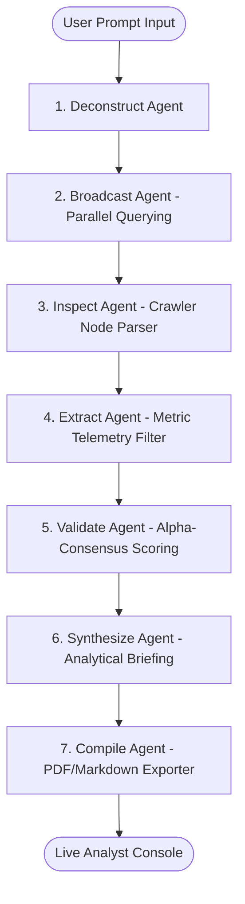

# 🔬 ResearchX - AI Research Intelligence Platform

ResearchX is a premium, enterprise-grade autonomous research platform. It leverages multi-agent orchestrations, real-time web crawlers, and semantic context engines to construct structured parameters, query global matrices, and compile verified, analyst-grade briefings.

---

## 🚀 Key Features

*   **Multi-Threaded Agent Orchestrator**: Coordinates planning, broadcasting, inspection, data extraction, evidence validation, and analytical synthesis.
*   **Context.dev Search Integration**: Integrates directly with the `Context.dev` search endpoint for live node searches, backed by mathematical $\alpha$-consensus scoring to evaluate domain and source credibility.
*   **Real-time HTTP Event Streaming**: Server endpoints stream progress JSON telemetry line-by-line using chunked streams for a zero-latency UI update loop.
*   **Frosted Glassmorphic Interface**: Premium responsive design styled with radial auroras, grid lines, and interactive Framer Motion animations.
*   **SSO Display Name Provisioning**: Enforces Display Name collections for both custom credentials and Google/GitHub SSO simulations, configuring profile avatars and dashboard greetings.
*   **Dual Theme System**: Full selector-based Light Slate (`#f8fafc`) and Dark Space (`#050816`) theme switchers with inline SVG icons and automatic local storage persistence.
*   **Analyst Control Panel**: Interactive configurations drawer for active LLM engine selections, API credential keys, and custom consensus threshold controls.

---

## 🛠️ System Architecture



---

## 📦 Tech Stack & Dependencies

*   **Framework**: Next.js 15 (Turbopack) App Router
*   **Language**: TypeScript (Strict checks)
*   **Animations**: Framer Motion
*   **Visualizations**: Recharts (Dynamic telemetric graphs)
*   **Icons**: Lucide React + Custom Inline SVGs
*   **Styling**: Tailwind CSS v4

---

## ⚙️ Local Development Setup

To provision the workspace locally:

1.  **Clone the Repository**:
    ```bash
    git clone https://github.com/Sairamparasa/ResearchX.git
    cd ResearchX
    ```

2.  **Install Dependencies**:
    ```bash
    npm install
    ```

3.  **Set Up Environment**:
    Create a `.env.local` file in the root directory:
    ```env
    # Add your active Context.dev secrets
    CONTEXT_API_KEY=ctxt_secret_bfa7e96897ec4f74990a59108e3b69a5
    ```

4.  **Boot the Development Server**:
    ```bash
    npm run dev
    ```

5.  **Access the Dashboard**:
    Open [http://localhost:3000](http://localhost:3000) in your web browser.

---

## 🛡️ Telemetry & Security Guards

*   **Redirection Guards**: Non-public routes (`/dashboard`, `/workspace`, `/report/[id]`) intercept access request tokens and redirect guests to `/login`.
*   **Tab Session Binding**: Active login tokens are kept in `sessionStorage` ensuring clean tab separation, automatically logging out when tab/browser sessions close.
*   **Redirection Query Preservation**: If a search query is submitted by an unauthenticated user, it is stored in `sessionStorage` and reloaded post-login, taking the user directly to the query results.
*   **Redirection Loop Prevention**: Logged-in users who attempt to manually visit `/login` are automatically redirected back to `/dashboard`.

---

## 📈 Deployment & Production Build

To build the optimized production package:
```bash
npm run build
npm run start
```

### Free Deployment on Vercel
1. Sign up for a free Hobby account at **[vercel.com](https://vercel.com)**.
2. Connect your GitHub account and import the **ResearchX** repository.
3. Click **Deploy**. Vercel will build and host the Next.js app on a free `*.vercel.app` subdomain with automatic continuous deployment on every git push.
